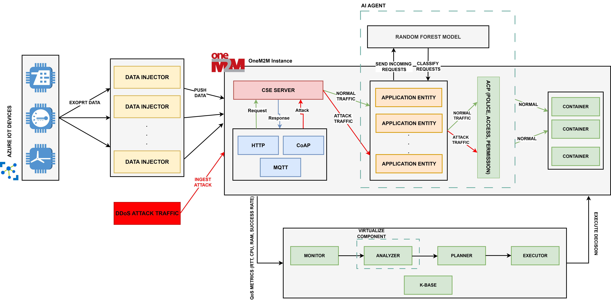

# oneM2M AI Agent Platform

An advanced IoT platform implementing the oneM2M standard with AI-powered DDoS protection and intelligent traffic management. This repository combines the Mobius oneM2M server with sophisticated MAPE-K (Monitor-Analyze-Plan-Execute-Knowledge) loop for cybersecurity protection and machine learning-based threat detection.

## System Architecture

<div align="center">

</div>

The platform integrates oneM2M-compliant IoT backend with AI-driven security, featuring:
- **Mobius Core**: oneM2M IN-CSE implementation for IoT device management
- **MAPE-K Protection**: AI-powered DDoS detection and traffic filtering
- **Machine Learning Models**: Pre-trained Random Forest and XGBoost models for threat detection
- **Comprehensive Monitoring**: Real-time metrics collection and analysis

## Table of Contents

- [Features](#features)
- [Project Structure](#project-structure)
- [Installation](#installation)
- [Usage](#usage)
- [MAPE-K Security System](#mapek-security-system)
- [Machine Learning Models](#machine-learning-models)
- [Configuration](#configuration)
- [Data & Analytics](#data--analytics)
- [Contributing](#contributing)
- [License](#license)

---

## Features

### Core oneM2M Platform
- oneM2M-compliant IoT backend (Mobius core)
- Multi-protocol support: HTTP, CoAP, MQTT, WebSocket
- Secure communication (TLS/SSL certificates included)
- Resource creation and management tools
- Comprehensive data logging and metrics

### AI-Powered Security
- **MAPE-K Loop**: Monitor-Analyze-Plan-Execute-Knowledge framework
- **Dual ML Models**: Random Forest + XGBoost ensemble for DDoS detection
- **Real-time Traffic Filtering**: AI-based request analysis and blocking
- **Adaptive Learning**: Incremental model updates and threshold optimization
- **IoT Device Recognition**: Pattern-based device identification
- **Rate Limiting**: Intelligent burst and frequency protection

### Advanced Analytics
- **Comprehensive Sensor Data**: 20+ sensor types with augmented information
- **System Health Monitoring**: CPU, memory, network metrics
- **Quality Metrics**: Data quality scoring and sensor health tracking
- **Spatial Data**: Location-aware sensor positioning
- **Jupyter Notebooks**: Model development and analysis notebooks

---

## Project Structure

```
.
├── mobius.js               # Main Mobius oneM2M server entry point
├── app.js                  # Core Mobius application logic
├── mobius/                 # oneM2M resource handlers and middleware
├── pxy_mqtt.js             # MQTT protocol proxy
├── pxy_coap.js             # CoAP protocol proxy  
├── pxy_ws.js               # WebSocket proxy
├── subscription.js         # Subscription management
├── wdt.js                  # Watchdog timer
├── APP/                    # Application scripts and AI tools
│   ├── main.py             # IoT data sender with MAPE-K protection
│   ├── mapek_system.py     # Complete MAPE-K DDoS protection system
│   ├── create_resources.py # oneM2M resource creation utility
│   └── venv/               # Python virtual environment
├── Models/                 # Pre-trained machine learning models
│   ├── best_random_forest_model.joblib
│   └── best_xgb_model.json
├── notebooks/              # Jupyter notebooks for analysis
│   ├── QoS_DDoS_Model.ipynb
│   └── cicddos-model-dev.ipynb
├── log/                    # System logs directory
├── conf.json               # Main configuration file
├── ca-crt.pem              # CA certificate
├── server-crt.pem          # Server certificate
├── server-key.pem          # Server private key
├── package.json            # Node.js dependencies
├── LICENSE
└── README.md
```

---

## Installation

### Prerequisites

- Node.js (v14+ recommended)
- Python 3.8+ (for AI components and data processing)
- npm (Node.js package manager)
- MySQL Server
- Git

### Setup

1. **Clone the repository:**
   ```bash
   git clone https://github.com/Younes1337/onem2m-ai-agent.git
   cd onem2m-ai-agent
   ```

2. **Install Node.js dependencies:**
   ```bash
   npm install
   ```

3. **Set up Python environment:**
   ```bash
   cd APP
   python3 -m venv venv
   source venv/bin/activate  # On Windows: venv\Scripts\activate
   pip install requests pandas scikit-learn numpy psutil joblib xgboost
   cd ..
   ```

4. **Set up MySQL Database:**
   ```bash
   sudo mysql -e "CREATE DATABASE mobiusdb;"
   sudo mysql mobiusdb < mobius/mobiusdb.sql
   sudo mysql -e "ALTER USER 'root'@'localhost' IDENTIFIED WITH mysql_native_password BY 'admin';"
   ```

5. **Verify ML models are in place:**
   ```bash
   ls -la Models/
   # Should show: best_random_forest_model.joblib and best_xgb_model.json
   ```

---

## Usage

### 1. Start Mobius Server

```bash
node mobius.js
```

The server will start using the configuration in `conf.json`.
- Default port: 7579
- oneM2M CSE base: `http://localhost:7579/Mobius`

### 2. Create oneM2M Resources

```bash
# Create test AE and container
python APP/create_resources.py

# Custom resources
python APP/create_resources.py --ae-name "MyGreenhouse" --container-name "SensorData"

# Remote server deployment
python APP/create_resources.py --remote
```

### 3. Send IoT Data with AI Protection

```bash
# Single data transmission with MAPE-K protection
python APP/main.py --mode single

# Continuous data transmission (10 samples, 5 seconds apart)
python APP/main.py --mode continuous --count 10 --interval 5

# Custom data input with augmented sensors
python APP/main.py --mode custom

# Remote server deployment
python APP/main.py --mode single --remote

# Disable MAPE-K protection (for testing)
python APP/main.py --mode single --no-mapek
```

### 4. MAPE-K Security Management

```bash
# View MAPE-K system status and metrics
python APP/main.py --mode status

# Simulate DDoS attack for testing
python APP/main.py --mode ddos-test
```

---

## MAPE-K Security System

The platform features a sophisticated MAPE-K (Monitor-Analyze-Plan-Execute-Knowledge) loop for intelligent DDoS protection:

### Monitor Component
- **Real-time Metrics**: CPU, memory, network performance
- **Request Tracking**: RTT, success rates, request patterns
- **System Health**: Comprehensive service monitoring

### Analyzer Component  
- **ML Ensemble**: Dual model approach (Random Forest + XGBoost)
- **Feature Extraction**: 9-dimensional feature vector for each request
- **Pattern Recognition**: IoT device behavior analysis
- **Anomaly Detection**: Statistical and rule-based methods

### Planner Component
- **Decision Engine**: Multi-criteria decision making
- **Threat Assessment**: Combined ML and rule-based scoring
- **Adaptive Thresholds**: Dynamic threshold adjustment
- **Knowledge Integration**: Learning from historical patterns

### Executor Component
- **Traffic Filtering**: Real-time request blocking
- **IP Management**: Whitelist/blacklist with CIDR support
- **Rate Limiting**: Burst and frequency control
- **Auto-blocking**: Intelligent IP blocking with expiration

### Knowledge Base
- **Pattern Storage**: Historical DDoS patterns
- **IoT Baselines**: Device behavior profiles
- **Learning History**: Continuous improvement data
- **Control Actions**: Audit trail of security decisions

---

## Machine Learning Models

The platform utilizes pre-trained machine learning models for DDoS detection:

### Model 1: Random Forest
- **File**: `Models/best_random_forest_model.joblib`
- **Purpose**: Primary DDoS classification
- **Features**: Traffic patterns, request characteristics
- **Fallback**: Isolation Forest if model unavailable

### Model 2: XGBoost  
- **File**: `Models/best_xgb_model.json`
- **Purpose**: Ensemble DDoS detection
- **Features**: Complementary feature set
- **Fallback**: Local Outlier Factor if model unavailable

### Ensemble Method
- **Combination**: 0.5 × Model1 + 0.5 × Model2
- **Output**: Anomaly score (0.0 - 1.0)
- **Threshold**: Adaptive DDoS threshold (default: 0.7)
- **Updates**: Incremental learning with new data

### Model Development
Jupyter notebooks are provided for model analysis and development:
- `notebooks/QoS_DDoS_Model.ipynb`: QoS-based DDoS modeling
- `notebooks/cicddos-model-dev.ipynb`: CIC-DDoS dataset development

---

## Configuration

### Server Configuration
Edit `conf.json` to set server parameters and database settings:

```json
{
    "csebaseport": "7579",
    "dbpass": "admin"
}
```

### MAPE-K Configuration
The MAPE-K system includes configurable parameters:
- `max_requests_per_minute`: Rate limiting threshold
- `max_requests_per_hour`: Hourly request limits  
- `burst_threshold`: Burst detection threshold
- `block_duration`: IP block duration (seconds)
- `ddos_threshold`: ML detection threshold

### Security Certificates
TLS/SSL certificates are included in the project root:
- `ca-crt.pem`: Certificate Authority
- `server-crt.pem`: Server certificate  
- `server-key.pem`: Server private key

---

## Data & Analytics

### IoT Data Structure
The platform sends comprehensive sensor data including:
- **Environmental Sensors**: Temperature, humidity, light, soil moisture, pH, nutrients
- **Augmented Sensors**: CO2, air pressure, wind speed, UV index, soil temperature
- **System Information**: Device ID, firmware version, battery, signal strength
- **Location Data**: Zone ID, coordinates, rack positioning
- **Quality Metrics**: Data quality scores, sensor health, calibration status

### Monitoring Data
- **Request Logs**: Complete request/response tracking
- **Performance Metrics**: RTT, throughput, success rates
- **Security Events**: Blocked requests, DDoS attempts
- **System Health**: CPU, memory, disk usage

### Export Capabilities
The MAPE-K system exports comprehensive data:
- **Metrics History**: JSON format with timestamps
- **Knowledge Base**: Patterns and learning data
- **Statistics**: Real-time and historical statistics
- **Model Updates**: Incremental learning data

---

## Contributing

Contributions are welcome! Please focus on:
- **Security Enhancements**: New detection algorithms, threat patterns
- **ML Improvements**: Model accuracy, feature engineering
- **IoT Integration**: Additional sensor types, device protocols
- **Performance**: Optimization, scalability improvements
- **Documentation**: Examples, tutorials, API docs

Please open issues or submit pull requests for bug fixes, new features, or documentation improvements.

---

## License

This project is licensed under the MIT License. See the `LICENSE` file for details.

---

# Legacy Mobius Documentation

# Mobius
oneM2M IoT Server Platform

## Version
2.5.x (2.5.13)

## Introduction
Mobius is the open source IoT server platform based on the oneM2M (http://www.oneM2M.org) standard. As oneM2M specifies, Mobius provides common services functions (e.g. registration, data management, subscription/notification, security) as middleware to IoT applications of different service domains. Not just oneM2M devices, but also non-oneM2M devices (i.e. by oneM2M interworking specifications and KETI TAS) can connect to Mobius.

## Certification
Mobius has been received certification of 'oneM2M standard' by TTA (Telecommunications Technology Association). oneM2M Certification guarantees that oneM2M products meet oneM2M Specification and Test requirements which ensure interoperability. As Mobius is certified, it will be used as a golden sample to validate test cases and testing system.

<div align="center">

</div>

TRSL (Test Requirements Status List) is available on oneM2M certification website (http://www.onem2mcert.com/sub/sub05_01.php).

## System Stucture
In oneM2M architecture, Mobius implements the IN-CSE which is the cloud server in the infrastructure domain. IoT applications communicate with field domain IoT gateways/devices via Mobius.

<div align="center">

</div>

## Connectivity Stucture
To enable Internet of Things, things are connected to &Cube via TAS (Thing Adaptation Software), then &Cube communicate with Mobius over oneM2M standard APIs. Also IoT applications use oneM2M standard APIs to retrieve thing data control things of Mobius.

<div align="center">

</div>

## Software Architecture

<div align="center">

</div>

## Supported Protocol Bindings
- HTTP
- CoAP
- MQTT
- WebSocket

## Installation
The Mobius is based on Node.js framework and uses MySQL for database.
<div align="center">

</div><br/>

- [MySQL Server](https://www.mysql.com/downloads/)<br/>
The MySQL is an open source RDB database so that it is free and ligth. And RDB is very suitable for storing tree data just like oneM2M resource stucture. Most of nCube-Rosemary will work in a restricted hardware environment and the MySQL can work in most of embeded devices.

- [Node.js](https://nodejs.org/en/)<br/>
Node.js® is a JavaScript runtime built on Chrome's V8 JavaScript engine. Node.js uses an event-driven, non-blocking I/O model that makes it lightweight and efficient. Node.js' package ecosystem, npm, is the largest ecosystem of open source libraries in the world. Node.js is very powerful in service impelementation because it provide a rich and free web service API. So, we use it to make RESTful API base on the oneM2M standard.

- [Mosquitto](https://mosquitto.org/)<br/>
Eclipse Mosquitto™ is an open source (EPL/EDL licensed) message broker that implements the MQTT protocol versions 3.1 and 3.1.1. MQTT provides a lightweight method of carrying out messaging using a publish/subscribe model. This makes it suitable for "Internet of Things" messaging such as with low power sensors or mobile devices such as phones, embedded computers or microcontrollers like the Arduino.

- [Mobius](https://github.com/IoTKETI/Mobius/archive/master.zip)<br/>
Mobius source codes are written in javascript. So they don't need any compilation or installation before running.

## Mobius Docker Version
We deploy Mobius as a Docker image using the virtualization open source tool Docker.

- [Mobius_Docker](https://github.com/IoTKETI/Mobius_Docker)<br/>

## Configuration
- Import SQL script<br/>
After installation of MySQL server, you need the DB Schema for storing oneM2M resources in Mobius. You can find this file in the following Mobius source directory.
```
[Mobius home]/mobius/mobiusdb.sql
```
- Run Mosquitto MQTT broker<br/>
```
mosquitto -v
```
- Open the Mobius source home directory
- Install dependent libraries as below
```
npm install
```
- Modify the configuration file "conf.json" per your setting
```
{
  "csebaseport": "7579", //Mobius HTTP hosting  port
  "dbpass": "*******"    //MySQL root password
}
```

## Run
Use node.js application execution command as below
```
node mobius.js
```

<div align="center">

</div><br/>

## Library Dependencies
This is the list of library dependencies for Mobius 
- body-parser
- cbor
- coap
- crypto
- events
- express
- file-stream-rotator
- fs
- http
- https
- ip
- js2xmlparser
- merge
- morgan
- mqtt
- mysql
- shortid
- url
- util
- websocket
- xml2js
- xmlbuilder

## Document
If you want more details please download the full [installation guide document](https://github.com/IoTKETI/Mobius/raw/master/doc/Installation%20Guide_Mobius_v2.0.0_EN(170718).pdf).

# Author
Jaeho Kim (jhkim@keti.re.kr)
Il Yeup Ahn (iyahn@keti.re.kr)
